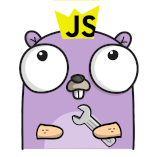

# JHP Home Page

Go and Javascript go together like Peanut Butter and Jelly. Thanks to the lovely work done in the otto and goja project, it is now viable to embed javascript in a go application.

Embedding javacsript in a go application is a reasonable way to implement plugin systems, scripting layers and even web frameworks!

# examples

- cmd/trivial is your starting point for evaluating a javascript expression inside a go program
- cmd/simple is a read eval print loop which may be useful as a starting point for creating interactive command line applications that support javascript.
- cmd/simplewww show's how we might integrate a javascript plugin layer inside a web response.
- cmd/routewww is an example of adding a routing layer, and using this to load special `.jhp` files. Like the good old days of running php on a shared host!

